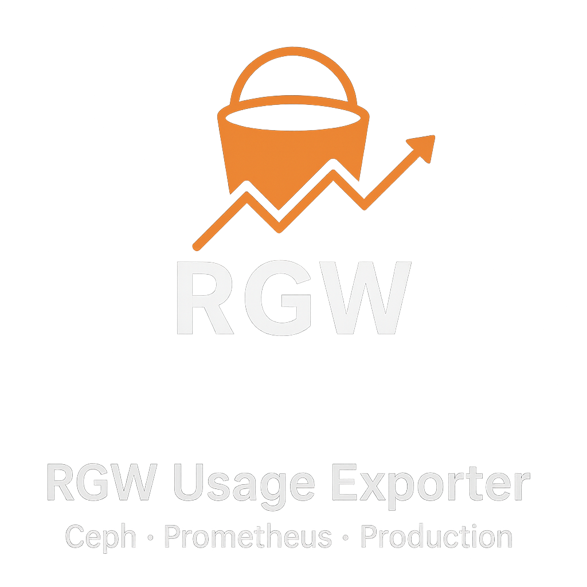

# 📦 RGW Usage Exporter for Ceph

Высокопроизводительный Prometheus-экспортер для **Ceph RGW (RADOS Gateway)**, предназначенный для **больших production-кластеров**.

Экспортер собирает usage-метрики напрямую через **RGW Admin API**, без тяжёлых `JOIN` в PromQL и без перегрузки Prometheus и Grafana.

Проект ориентирован на:
- десятки и сотни тысяч бакетов,
- миллионы и сотни миллионов объектов,
- многопользовательские S3-кластеры,
- реальную эксплуатацию под нагрузкой.

---

## ✨ Ключевые особенности

- 🚀 **Производительность**
  - оптимизирован для больших кластеров;
  - минимальные аллокации и нагрузка на GC;
  - отсутствие PromQL `group_left` / `join`.

- 📊 **Полная RGW-статистика**
  - операции (GET / PUT / LIST и др.);
  - размеры бакетов (logical / actual);
  - количество объектов;
  - shards и objects per shard.

- 👤 **Пользователи и квоты**
  - user quota;
  - user bucket quota;
  - использованный объём;
  - процент использования квоты.

- 📦 **Бакеты**
  - `uid` присутствует во всех bucket-метриках;
  - quota usage %;
  - удобная фильтрация в Grafana без join.

- ⚙️ **Гибкая конфигурация**
  - настройка через переменные окружения;
  - поддержка multiple RGW / регионов / кластеров.

---

## Архитектурный принцип

**UID владельца бакета добавляется в bucket-метрики на уровне экспортера.**

Это означает:

- ❌ не требуется `bucket_metadata`;
- ❌ не нужны `group_left` и `join` в PromQL;
- ✅ быстрые и дешёвые запросы;
- ✅ Grafana-таблицы не тормозят;
- ✅ масштабируемость на большие инсталляции Ceph.

---

## 📡 Экспортируемые метрики

### Usage (per user / bucket / category)
```yaml
radosgw_usage_ops_total
radosgw_usage_successful_ops_total
radosgw_usage_sent_bytes_total
radosgw_usage_received_bytes_total
```
labels: {region, cluster, endpoint, uid, bucket, category}

---
### Bucket-level
```yaml
radosgw_usage_bucket_size
radosgw_usage_bucket_actual_size
radosgw_usage_bucket_objects
radosgw_usage_bucket_num_shards
radosgw_usage_bucket_objects_per_shard

radosgw_usage_bucket_quota_enabled
radosgw_usage_bucket_quota_size
radosgw_usage_bucket_quota_objects
radosgw_usage_bucket_quota_usage_percent
```
labels: {region, cluster, endpoint, bucket, uid}

---
### User-level
```yaml
radosgw_usage_user_suspended

radosgw_usage_user_quota_enabled
radosgw_usage_user_quota_size_bytes
radosgw_usage_user_quota_objects

radosgw_usage_user_bucket_quota_enabled
radosgw_usage_user_bucket_quota_size_bytes
radosgw_usage_user_bucket_quota_objects

radosgw_usage_user_used_size_bytes
radosgw_usage_user_quota_usage_percent
```

---
### Cluster aggregates
```yaml
radosgw_usage_buckets_total
radosgw_usage_users_total
radosgw_usage_objects_total

radosgw_usage_buckets_size_total_bytes
radosgw_usage_buckets_actual_size_total_bytes
radosgw_usage_bucket_quotas_size_total_bytes
radosgw_usage_user_quotas_size_total_bytes
```


---

## ⚙️ Конфигурация

Экспортер настраивается через переменные окружения.

| Переменная | Описание |
|-----------|----------|
| `ACCESS_KEY` | RGW admin access key |
| `SECRET_KEY` | RGW admin secret key |
| `RGW_ENDPOINT` | Внутренний RGW Admin endpoint |
| `PUB_ENDPOINT` | Публичный S3 endpoint (используется как label `endpoint`) |
| `REGION` | Регион / зона |
| `CLUSTER_NAME` | Имя кластера |
| `LISTEN_IP` | IP для `/metrics` |
| `LISTEN_PORT` | Порт (по умолчанию `9240`) |
| `USAGE_COLLECTOR_INTERVAL` | Интервал сборки usage (сек) |
| `BUCKETS_COLLECTOR_INTERVAL` | Интервал сборки bucket-метрик |
| `USERS_COLLECTOR_INTERVAL` | Интервал сборки user-метрик |
| `USERS_COLLECTOR_ENABLE` | `true` / `false` |
| `RGW_CONNECTION_TIMEOUT` | Таймаут подключения к RGW |
| `START_DELAY` | Задержка старта экспортера |
| `INSECURE` | Отключить TLS verify |
| `SKIP_WITHOUT_BUCKET` | Пропуск записей без bucket |

---

## ▶️ Запуск через Podman

```bash
podman run -d \
  --name rgw-exporter \
  --network host \
  -e ACCESS_KEY=xxxx \
  -e SECRET_KEY=yyyy \
  -e RGW_ENDPOINT=https://rgw-admin:443 \
  -e PUB_ENDPOINT=s3.example.com \
  -e REGION=XS \
  -e CLUSTER_NAME=PRS1 \
  -e USERS_COLLECTOR_ENABLE=true \
  docker.io/yeti89/rgw-exporter:latest
```

Метрики будут доступны по адресу:
```bash
curl http://<host>:9240/metrics
```

## 📈 Примеры PromQL

Получить все бакеты пользователя:
```yaml
radosgw_usage_bucket_size{uid="user1"}
```

Топ пользователей по использованному объёму:
```yaml
topk(10, radosgw_usage_user_used_size_bytes)
```

Проблемные бакеты с большим числом объектов на shard:
```yaml
radosgw_usage_bucket_objects_per_shard > 500000
```

## 🧪 Для каких кластеров подходит
✅ Production-кластеров Ceph.  
✅ Multi-RGW.  
✅ 100k+ бакетов.  
✅ Миллионы объектов.  
✅ Cложных Grafana-дашбордов.  
✅ Долгосрочного мониторинга и capacity-planning.  

### 📜 Лицензия
- MIT

### 🤝 Контрибьютинг
PR, issues и идеи приветствуются.  
Проект активно используется в production-кластерах Ceph.

